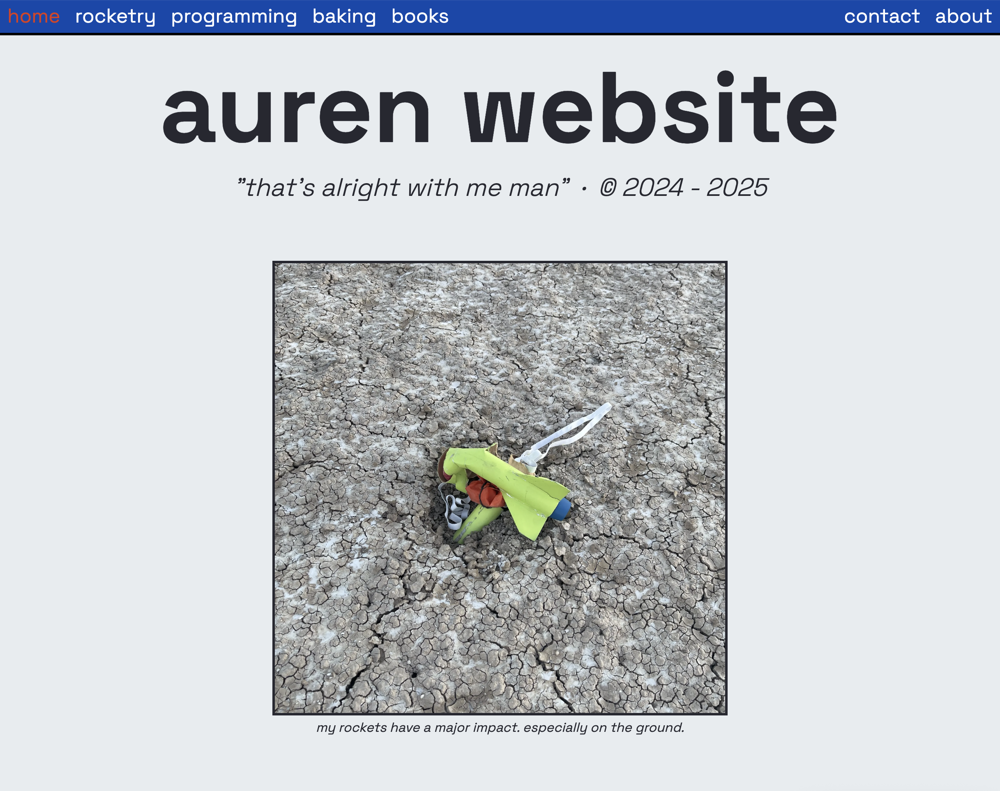

# Personal Website (aurenamster.com)

<!--- it's a website. go to it.
[really cool website](https://aurenamster.com) -->

Visit my personal website (live on the internet): [aurenamster.com](https://aurenamster.com)

I wrote my webserver from scratch in NodeJS, which includes a custom API for accessing my [archive's](https://aurenamster.com/rocketry/archive) Postgres database from within the public-facing website. You can learn a bit more about the story of this site at [aurenamster.com/about](https://aurenamster.com/about).

